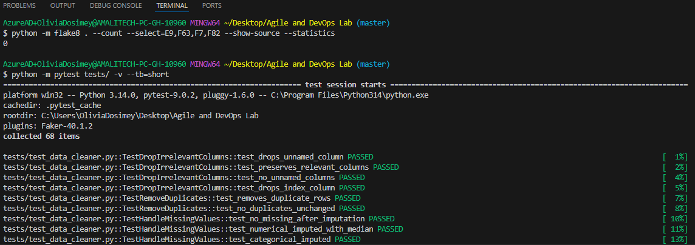

# Flight Fare Prediction Using Machine Learning

## Project Overview
An end-to-end machine learning pipeline for predicting flight fares based on key travel and airline information from Bangladesh. This project applies the full data science workflow -- from problem framing and data cleaning to model training, evaluation, and optimization -- while following **Agile principles** and **DevOps practices**.

## Problem Statement
Airlines and travel platforms need to estimate ticket prices based on route, airline, and travel date to optimize pricing strategy and dynamic recommendations. This project builds predictive models using historical flight price data to forecast total fares.

## Dataset
- **Source:** [Flight Price Dataset of Bangladesh](https://www.kaggle.com/) (Kaggle)
- **File:** `Flight_Price_Dataset_of_Bangladesh.csv`
- **Target Variable:** `Total Fare`
- **Features:** Airline, Source, Destination, Date, Base Fare, Tax & Surcharge, etc.

## Project Structure
```
Agile and DevOps Lab/
|-- data/                          # Raw and processed datasets
|   |-- Flight_Price_Dataset_of_Bangladesh.csv
|-- docs/                          # Agile & project documentation
|   |-- sprint0_planning.md        # Product backlog, user stories, DoD
|   |-- sprint1_review.md          # Sprint 1 review & demo
|   |-- sprint1_retrospective.md   # Sprint 1 retrospective
|   |-- sprint2_review.md          # Sprint 2 review & demo
|   |-- sprint2_retrospective.md   # Sprint 2 retrospective
|-- src/                           # Source code modules
|   |-- __init__.py
|   |-- data_loader.py             # Data loading utilities
|   |-- data_cleaner.py            # Data cleaning & preprocessing
|   |-- eda.py                     # Exploratory data analysis
|   |-- feature_engineering.py     # Feature engineering pipeline
|   |-- model_training.py          # Model training & evaluation
|   |-- monitoring.py              # Pipeline monitoring & logging
|-- tests/                         # Unit and integration tests
|   |-- __init__.py
|   |-- test_data_loader.py
|   |-- test_data_cleaner.py
|   |-- test_feature_engineering.py
|   |-- test_integration.py
|-- outputs/                       # Generated plots & reports
|   |-- plots/
|   |-- reports/
|-- .github/                       # CI/CD pipeline
|   |-- workflows/
|       |-- ci.yml
|-- .gitignore
|-- requirements.txt
|-- README.md
```

## Getting Started

### Prerequisites
- Python 3.9+
- pip (Python package manager)

### Installation
```bash
# Clone the repository
git clone <repository-url>
cd "Agile and DevOps Lab"

# Create a virtual environment
python -m venv venv

# Activate the virtual environment
# On Windows:
venv\Scripts\activate
# On macOS/Linux:
source venv/bin/activate

# Install dependencies
pip install -r requirements.txt
```

### Running the Pipeline
```bash
# Run individual modules
python -m src.data_loader
python -m src.data_cleaner
python -m src.eda
```

### Running Tests
```bash
pytest tests/ -v
```

## Agile Methodology
This project follows an Agile approach with 3 sprints:

| Sprint | Focus | Status |
|--------|-------|--------|
| Sprint 0 | Planning & Setup | Complete |
| Sprint 1 | Data Foundation & EDA | Complete |
| Sprint 2 | ML Modeling & Optimization | Complete |

See [`docs/sprint0_planning.md`](docs/sprint0_planning.md) for the complete product backlog and sprint plans.

## DevOps Practices
- **Version Control:** Git with meaningful commit messages
- **CI/CD:** GitHub Actions for automated testing and linting
- **Testing:** Unit tests with pytest
- **Monitoring:** Logging integrated into the ML pipeline

## CI/CD Evidence

Due to GitHub Actions billing limits ("account locked due to billing issue"), the CI pipeline was validated locally.

### Local Linting & Testing Success

*(Please ensure the image file `ci_evidence.png` is in the root directory or update the path)*

## Models Explored
- Linear Regression (Baseline)
- Ridge Regression
- Lasso Regression
- Decision Tree Regressor
- Random Forest Regressor

## Evaluation Metrics
- **R-squared (Coefficient of Determination)**
- **MAE (Mean Absolute Error)**
- **RMSE (Root Mean Squared Error)**

## Author
Olivia Dosimey

## License
This project is for educational purposes as part of the Agile and DevOps Lab module.
